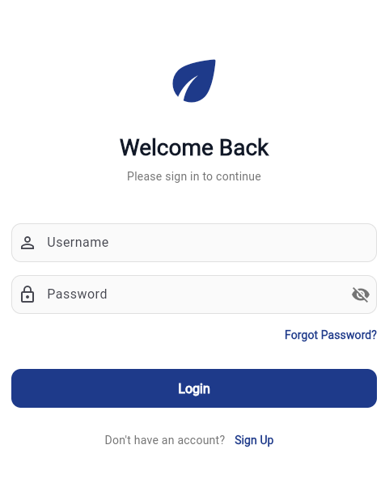

# 🌟 Login Screen UI

<div align="center">
  
  
  
</div>

<br>

<div align="center">
  
</div>

<br>

Welcome to the **Clean & Modern Login Screen** repository! This project features a beautifully designed, responsive, and minimalist login interface built entirely with Flutter. 🚀

---

## ✨ Features

- **🎨 Professional Color Scheme:** A clean `Deep Blue` (`#1E3A8A`) and crisp `White` palette for a trustworthy, enterprise-grade feel.
- **📱 Fully Responsive:** Carefully wrapped in a `SingleChildScrollView` to perfectly adapt to all screen sizes and prevent keyboard overflow.
- **👁️ Password Visibility Toggle:** Includes an interactive icon to hide or reveal the user's password seamlessly.
- **🧩 Modular Architecture:** Code is neatly separated into multiple files (`main.dart` for the theme/setup and `login_screen.dart` for the UI) to ensure high maintainability.

---

## 📂 Project Structure

```text
lib/
├── main.dart            # Application entry point & Global Theme definitions
└── login_screen.dart    # Login Screen UI and layout logic
```

---

## 🛠️ Getting Started

Follow these instructions to get the project up and running on your local machine.

### Prerequisites

Make sure you have Flutter installed. If not, follow the official [Flutter Setup Guide](https://docs.flutter.dev/get-started/install).

### Installation

1. **Clone the repository:**

   ```bash
   git clone https://github.com/your-username/login_screen.git
   ```

2. **Navigate to the directory:**

   ```bash
   cd login_screen
   ```

3. **Install dependencies:**

   ```bash
   flutter pub get
   ```

4. **Run the app:**
   ```bash
   flutter run
   ```

---

## 💡 Design Inspiration

The UI was crafted with modern mobile design principles in mind:

- **Rounded Corners:** Softens the UI, making it more approachable (12px border radius).
- **Clear Call to Actions:** The Login button stretches across the screen, eliminating any confusion about the primary action.
- **Subtle Interactions:** Input fields have distinct states (enabled vs focused) to provide immediate feedback to the user.

---

<div align="center">
  <i>Built with ❤️ using Flutter.</i>
</div>
